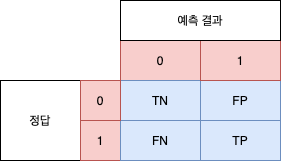
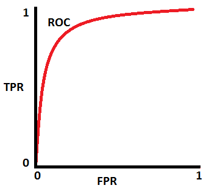

# Evaluation Method

## Classification Problem

### Confusion Matrix

The confusion matrix organizes the results of the classification in a tabular format to check which data is correctly or incorrectly classified.

```python
from sklearn.metrics import confusion_matrix
cm = confusion_matrix(expect, predict)
print(cm)
```

The result shows like below.



|Item|Description|
|-|-|
|TN (True Negative) | The actual negative data was correctly predicted as negative|
|FP (False Positive) | The actual negative data was incorrectly predicted as positive|
|FN (False Negative) | The actual positive data was incorrectly predicted as negative|
|TP (True Positive) | The actual positive data was correctly predicted as positive|

### Accuracy

Accuracy is the ratio accurately predicted among the overall prediction results.

```
      TP + TN
-------------------
 TP + TN + FP + FN
```

```python
from sklearn.metrics import accuracy_score
acs = accuracy_score(expect, predict)
```

### Precision

Precision is the ratio that is actually positive among the results predicted by positive.

```
   TP
---------
 TP + FP
```

```python
from sklearn.metrics import precision_score
ps = precision_score(expect, predict)
```

### Recall

Recall is the ratio that correctly predicts positive among the actually positive.

```
   TP
---------
 TP + FN
```

```python
from sklearn.metrics import recall_score
rs = recall_score(expect, predict)
```

### F1-Score

F1-score is an evaluation indicator that reflects both Precision and Recall.

```
 2 x (Precision x Recall)
--------------------------
   (Precision + Recall)
```

```python
from sklearn.metrics import f1_score
f1s = f1_score(expect, predict)
```

## Prediction Probability

```python
from sklearn.linear_model import LogisticRegression
model_lr = LogisticRegression(solver='lbfgs')
model_lr.fit(x, y)
model_lr.predict_proba(x)

```

## ROC Curve and AUC

If there are large differences in the number of positive data and negative data, the evaluation indicator may not be meaningful. `AUC(Area Under the Curve)` and `ROC(Receiver Operating Characteristic) Curve` are evaluation indicators used in this case.



If the AUC is close to 1, it means that the Precision is high, and if it is near 0.5, the prediction is poor. In other words, if it is near 0.5, it is equal to the probability of throwing a coin to come forward or backward.

```python
from sklearn.metrics import roc_curve
fpr, tpr, threshold = roc_curve(expect, probaility[:, 1])

from sklearn.metrics import roc_auc_score
ras = roc_auc_score(expect, probability[:,1])
```

## Regression Problem

### Mean Squared Error

The squared error represents the difference between the actual value and the predicted value.

MSE is the average of the squared errors between the actual value and the predicted values. It means that the smaller MSE, the better predicted value.

In MSE, when the variance of the dependent variable is large, the MSE also increases, so it is sometimes difficult to judge whether the precision is good or bad.

```python
from sklearn.metrics import mean_squared_error
mse = mean_squared_error(expect, predict)
```

### Determination coefficient

The determination coefficient represents the fitness of the model predictions learned using the MSE. If the determination coefficient is the maximum value of 1.0, it means no error.

```python
from sklearn.metrics import r2_score
r2s = r2_score(expect, ,predict)
```
